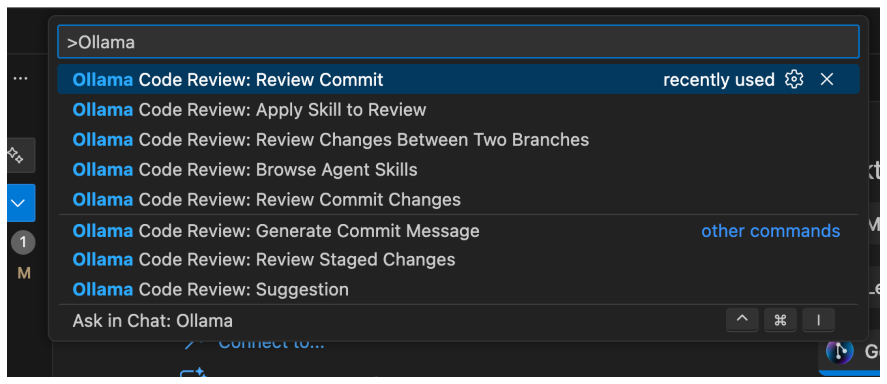
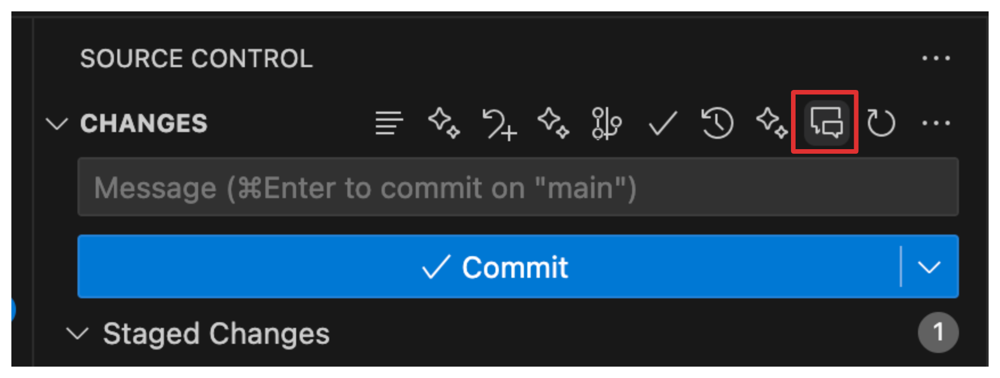
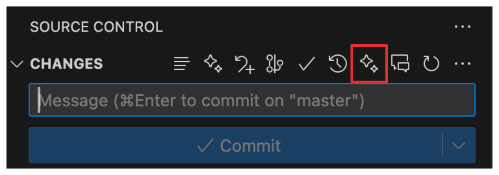
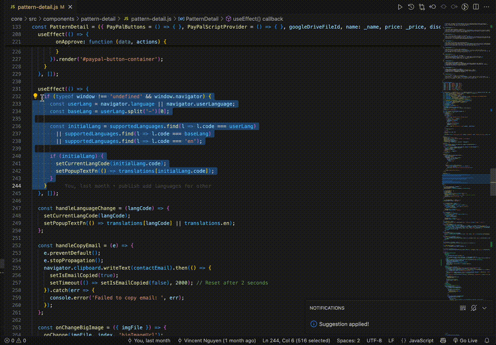
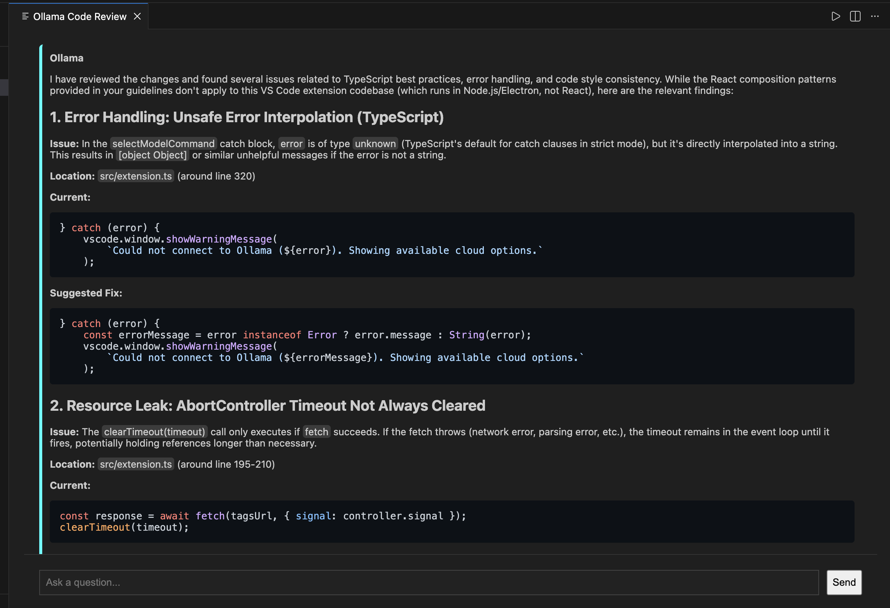
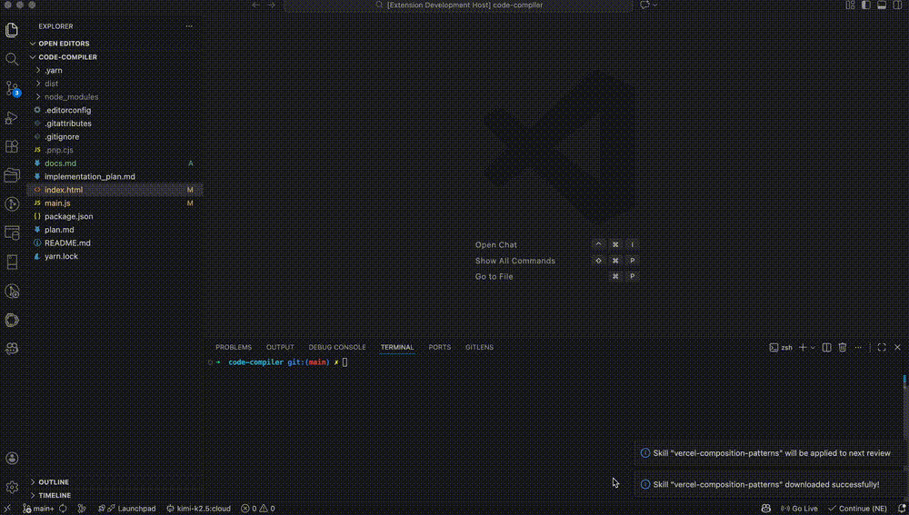
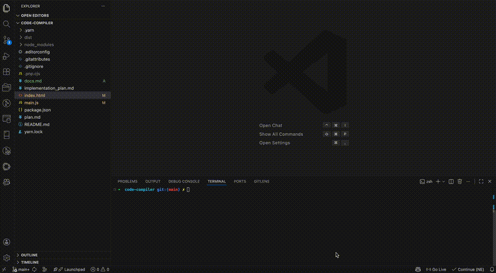
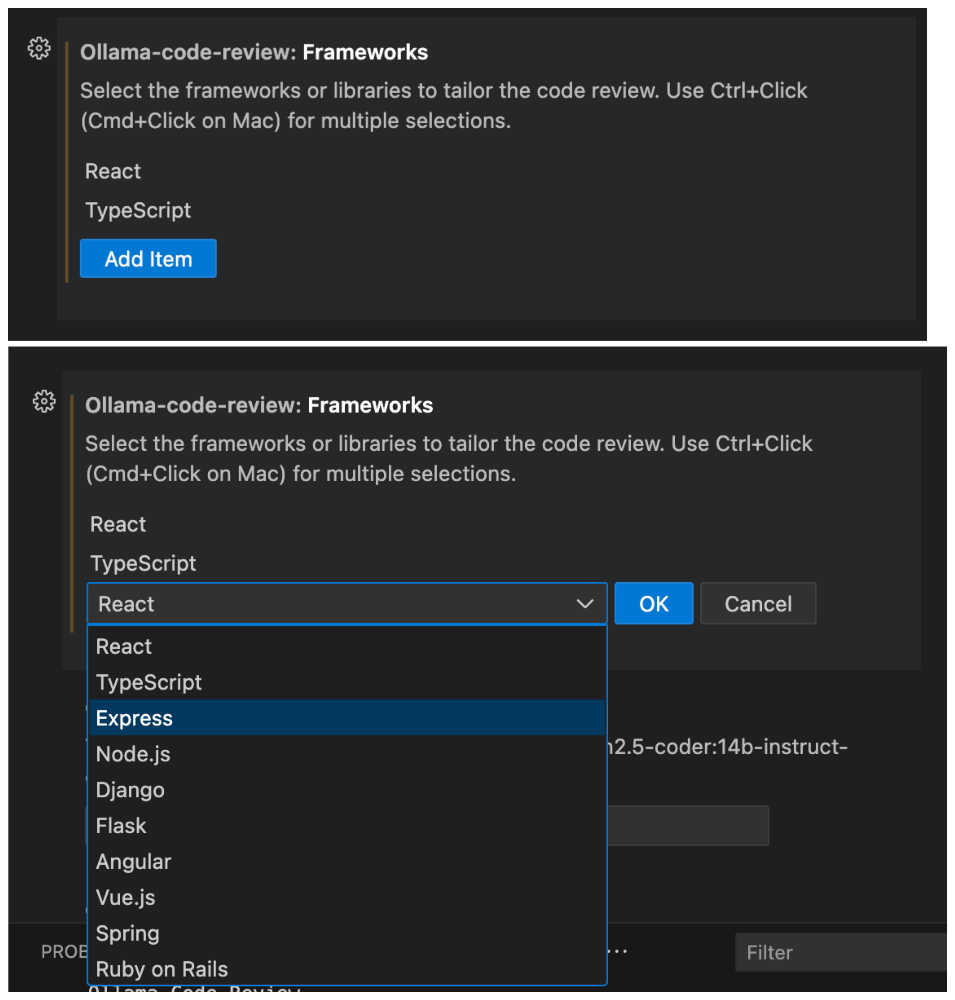

# Ollama Code Review

[](https://marketplace.visualstudio.com/items?itemName=VinhNguyen-Vincent.ollama-code-review)
[](https://marketplace.visualstudio.com/items?itemName=VinhNguyen-Vincent.ollama-code-review)
[](https://github.com/glorynguyen/ollama-code-review/releases)
[](https://github.com/glorynguyen/ollama-code-review/actions/workflows/release.yml)
[](https://github.com/glorynguyen/ollama-code-review/blob/main/LICENSE.md)
[](https://github.com/glorynguyen/ollama-code-review/stargazers)
[](https://github.com/glorynguyen/ollama-code-review/forks)
[](https://github.com/glorynguyen/ollama-code-review/issues)
[](https://www.typescriptlang.org/)
[](https://code.visualstudio.com/)

Get lightning-fast, expert code reviews and AI-generated commit messages directly in your editor using local Ollama models, cloud AI providers like **Claude (Anthropic)**, **Gemini (Google AI)**, **Mistral AI**, **MiniMax**, **GLM (Z.AI)**, and **Hugging Face**, or **any OpenAI-compatible server** such as LM Studio, vLLM, LocalAI, Groq, and OpenRouter. This extension analyzes your code changes before you commit, helping you catch bugs, improve code quality, and write consistent, informative commit messages.

It leverages the power of local large language models to provide feedback on:
- Potential bugs and logical errors
- Performance optimizations
- Security vulnerabilities
- Adherence to best practices
- Code readability and maintainability

## Usage

You can interact with this extension in two primary ways:

**Command Palette**: Press `Ctrl+Shift+P` (or `Cmd+Shift+P` on Mac), type `Ollama`, and select the desired action from the list.



## Features

**Ollama Code Review** integrates seamlessly into your Git workflow with the following commands:

### 1. Review Staged Changes
- **Command**: `Ollama: Review Staged Changes`
- Get an AI review of all your currently staged changes.
- **Quick Access**: A convenient button `$(comment-discussion)` is also available in the Source Control panel's title bar.


### 2. Generate Commit Message
- **Command**: `Ollama: Generate Commit Message`
- Automatically generates a descriptive, conventional commit message based on your staged changes. The generated message is then populated directly into the Source Control input box.
- **Quick Access**: A `$(sparkle)` icon is available in the Source Control panel's title bar for one-click generation.



### 3. Suggest Code Improvements
- **Command**: `Ollama: Suggestion`
- Select any block of code in your editor, right-click, and choose this command to get an instant refactoring suggestion from Ollama. The extension presents the suggested code and an explanation in a pop-up, allowing you to apply the changes with a single click.


- Alternatively (currently only JavaScript and TypeScript are supported), you can select a block of code, click on the light bulb icon, and choose "Ollama: Suggest Refactoring"


### 4. Inline AI Code Actions
Select any code in your editor and access powerful AI-powered actions via the lightbulb menu or `Ctrl+.` (`Cmd+.` on Mac):

- **Explain Code**: Get detailed explanations of selected code displayed in a preview panel. Understand complex logic, algorithms, or unfamiliar code patterns.
- **Generate Tests**: Automatically generate unit tests for your code with framework detection (Jest, Mocha, Vitest, etc.). Preview tests before creating the test file.
- **Fix Issue**: Get AI-powered fixes for diagnostics or selected code. View changes in a diff preview before applying them with one click.
- **Add Documentation**: Generate JSDoc/TSDoc comments for functions, classes, and methods. Preview documentation before inserting it into your code.

Each action opens a dedicated preview panel where you can review the AI's output before applying changes to your code.

Supported languages: JavaScript, TypeScript, JSX, TSX, and **PHP**.

### 5. Review a Commit Range
- **Command**: `Ollama: Review Commit Range`
- Analyze a series of commits. The extension will prompt you to select a starting commit from your history, and it will generate a review for all changes from that point up to `HEAD`.

### 6. Review Changes Between Two Branches
- **Command**: `Ollama: Review Changes Between Two Branches`
- Ideal for pull requests. Compare any two branches or git refs (like tags or commit hashes) to get a comprehensive review of the differences.

### 7. Detailed Review Output
All feedback from Ollama is displayed in a dedicated "Ollama Code Review" output channel, keeping your editor clean. The output includes a list of the files that were analyzed in the review.



### 8. Agent Skills (Multi-Skill Support)
- **Command**: `Ollama Code Review: Browse Agent Skills`
- **Command**: `Ollama Code Review: Apply Skills to Review`
- **Command**: `Ollama Code Review: Clear Selected Skills`
- Enhance your code reviews by downloading specialized "skills" from GitHub (defaulting to `vercel-labs/agent-skills`).
- These skills provide the AI with specific context or specialized rules (e.g., "Performance Expert," "Security Auditor," or "Accessibility Specialist").
- **Multi-Skill Selection**: Select multiple skills simultaneously to combine their expertise in a single review. For example, apply both "Security Auditor" and "Performance Expert" skills together.
- **Workflow**:
  1. Browse the library and download skills you want to use
  2. Use "Apply Skills to Review" to select one or more skills (previously selected skills are pre-checked)
  3. Run your code review - all selected skills will be applied
  4. Use "Clear Selected Skills" to quickly deselect all skills



### 9. Review a Specific Commit
- **Command**: `Ollama Code Review: Review Commit`
- Review any historical commit. You can enter a hash, select from a list of the 50 most recent commits, or trigger it directly from the **Git Graph** extension context menu.

### 10. Detailed Review Output
All feedback from Ollama is displayed in a dedicated "Ollama Code Review" output channel... 
- **New**: The review panel now features a **"Copy Review"** button to quickly copy the entire Markdown feedback to your clipboard for sharing in Pull Requests or Slack.

### 11. Dynamic Model Selection & Status Bar
- **Command**: `Ollama Code Review: Select Ollama Model`
- **Quick Access**: Look for the model name (e.g., `ollama: llama3`) in the **Status Bar** at the bottom of your editor. Click it to switch models instantly.
- **Auto-Discovery**: The extension automatically fetches all models currently installed on your local Ollama instance.
- **Cloud Support**: Even if Ollama isn't running locally, you can switch to configured cloud-based models (like Kimi, Qwen, or GLM) or set a custom model name.
- **Smart Fallbacks**: If the connection to the Ollama API fails, the extension gracefully provides a list of cloud and custom options so you're never stuck.



### 12. Claude (Anthropic) Support
Use Anthropic's powerful Claude models for code reviews:
- **Claude Sonnet 4** - Fast, capable model for everyday reviews
- **Claude Opus 4** - Most capable model for complex analysis
- **Claude 3.7 Sonnet** - Balanced performance and quality

To use Claude models:
1. Get your API key from [Anthropic Console](https://console.anthropic.com/)
2. Set your API key in settings: `ollama-code-review.claudeApiKey`
3. Select a Claude model from the status bar or command palette

### 13. GLM (Z.AI/Zhipu) Support
Use GLM models via the Z.AI (BigModel/Zhipu) API:
- **GLM-4.7 Flash** - Fast and free-tier model for code reviews

To use GLM models:
1. Get your API key from [Z.AI Open Platform](https://open.bigmodel.cn/)
2. Set your API key in settings: `ollama-code-review.glmApiKey`
3. Select `glm-4.7-flash` from the model picker

### 14. Gemini (Google AI) Support
Use Google's Gemini models via the free Google AI Studio API:
- **Gemini 2.5 Flash** - Fast model with 250 requests/day free tier (15 RPM)
- **Gemini 2.5 Pro** - More capable model with 100 requests/day free tier (5 RPM)
- Both models feature a massive 1-million-token context window

To use Gemini models:
1. Get your API key from [Google AI Studio](https://aistudio.google.com/) (no credit card required)
2. Set your API key in settings: `ollama-code-review.geminiApiKey`
3. Select `gemini-2.5-flash` or `gemini-2.5-pro` from the model picker

### 15. Mistral AI Support
Use Mistral AI's powerful models for code reviews:
- **Mistral Large** - Most capable model for complex analysis
- **Mistral Small** - Fast and efficient for everyday reviews
- **Codestral** - Specifically optimized for code generation and review

To use Mistral models:
1. Get your API key from [Mistral Console](https://console.mistral.ai/)
2. Set your API key in settings: `ollama-code-review.mistralApiKey`
3. Select `mistral-large-latest`, `mistral-small-latest`, or `codestral-latest` from the model picker

### 16. MiniMax Support
Use MiniMax's models for code reviews:
- **MiniMax M2.5** - Powerful model for code review and analysis

To use MiniMax models:
1. Get your API key from [MiniMax Platform](https://platform.minimaxi.com/)
2. Set your API key in settings: `ollama-code-review.minimaxApiKey`
3. Select `MiniMax-M2.5` from the model picker

### 17. Hugging Face Support
Use any model from the Hugging Face Inference API:
- Access thousands of open-source models
- **Smart Model Picker**: When selecting `huggingface`, a submenu appears with:
  - **Recently Used**: Your last 5 HF models for quick switching
  - **Popular Models**: Curated list of coding models (customizable)
  - **Custom**: Enter any HF model identifier manually
- This makes it easy to quickly switch models when one is busy or returns errors (401/503)

To use Hugging Face models:
1. Get your API token from [Hugging Face Settings](https://huggingface.co/settings/tokens)
2. Set your token in settings: `ollama-code-review.hfApiKey`
3. Select `huggingface` from the model picker → choose from recent, popular, or enter custom
4. (Optional) Customize the popular models list via `ollama-code-review.hfPopularModels`

**Default Popular Models:**
- `Qwen/Qwen2.5-Coder-7B-Instruct`
- `Qwen/Qwen2.5-Coder-32B-Instruct`
- `mistralai/Mistral-7B-Instruct-v0.3`
- `codellama/CodeLlama-7b-Instruct-hf`
- `bigcode/starcoder2-15b`
- `meta-llama/Llama-3.1-8B-Instruct`
- `deepseek-ai/DeepSeek-Coder-V2-Lite-Instruct`

### 18. OpenAI-Compatible Server Support
Use any server that exposes an OpenAI-compatible `/v1/chat/completions` endpoint — no individual integration required:

| Server | Type | Default Endpoint |
|--------|------|-----------------|
| **LM Studio** | Local | `http://localhost:1234/v1` |
| **LocalAI** | Local | `http://localhost:8080/v1` |
| **vLLM** | Local | `http://localhost:8000/v1` |
| **Groq** | Cloud | `https://api.groq.com/openai/v1` |
| **OpenRouter** | Cloud | `https://openrouter.ai/api/v1` |
| **Together AI** | Cloud | `https://api.together.xyz/v1` |
| Any other OpenAI-compatible API | — | Custom URL |

**Smart Setup Picker**: When you select `openai-compatible` from the model picker, a guided flow appears:
1. Choose from popular server presets or enter a custom endpoint URL
2. Enter the model name (e.g., `lmstudio-community/Meta-Llama-3.1-8B-Instruct-GGUF`, `llama3`, `gpt-4o`)
3. Settings are saved automatically — no manual JSON editing required

To use an OpenAI-compatible server:
1. Start your server (e.g., open LM Studio and load a model)
2. Select `openai-compatible` from the status bar model picker
3. Pick your server preset or enter a custom endpoint
4. Enter the model name and you're ready to go

**Optional API key**: Leave `ollama-code-review.openaiCompatible.apiKey` empty for local servers that don't require authentication (LM Studio, LocalAI, vLLM). Set it for cloud services like Groq or OpenRouter.

### 19. Custom Prompt Templates
Customize the AI prompts used for code reviews and commit message generation:
- **Review Prompt**: Override the default code review prompt with your own template
- **Commit Message Prompt**: Customize how commit messages are generated

Use variable placeholders that get replaced at runtime:
- **Review**: `${code}` (the diff), `${frameworks}` (selected frameworks), `${skills}` (active agent skills), `${profile}` (active review profile context)
- **Commit Message**: `${diff}` (staged diff), `${draftMessage}` (developer's draft)

Configure via (in order of increasing priority):
- `ollama-code-review.prompt.review` — multiline text area in Settings UI
- `ollama-code-review.prompt.commitMessage` — multiline text area in Settings UI
- `.ollama-review.yaml` at the workspace root — highest priority, overrides all other sources (see section 19)

> **Note:** If your custom review prompt omits `${skills}`, active agent skills are automatically appended. Likewise, if `${profile}` is omitted, the active review profile context is automatically appended.

### 20. Project Config File (.ollama-review.yaml)
Share consistent AI review settings across your whole team by adding a `.ollama-review.yaml` file to the root of your repository. Settings in this file override both the built-in defaults and your VS Code `settings.json`, making it easy for everyone on the team to use the same prompts, frameworks, and diff filters without individual configuration.

- **Command**: `Ollama Code Review: Reload Project Config (.ollama-review.yaml)` — manually refresh the cached config after editing the file (usually not needed, as the extension auto-detects changes).

**Example `.ollama-review.yaml`:**

```yaml
# Custom review prompt (overrides VS Code settings)
prompt:
  review: |
    Review the following code diff for our React + TypeScript project.
    Focus on type safety, React best practices, and accessibility.
    Diff:
    ${code}
  commitMessage: |
    Generate a Conventional Commits message for this diff:
    ${diff}

# Frameworks list (overrides ollama-code-review.frameworks setting)
frameworks:
  - React
  - TypeScript
  - Node.js

# Diff filter overrides
diffFilter:
  ignorePaths:
    - "**/generated/**"
  ignoreFormattingOnly: true
```

The extension automatically watches `.ollama-review.yaml` for changes (create, edit, delete) and reloads the config without requiring a VS Code restart.

### 21. Smart Diff Filtering
Reduce noise in your code reviews by filtering out irrelevant changes:
- **Ignore paths**: Skip `node_modules`, lock files, build outputs
- **Ignore patterns**: Exclude minified files, source maps, generated code
- **Large file warnings**: Get notified when files exceed a line threshold
- **Formatting-only detection**: Optionally skip files with only whitespace changes

Configure in settings under `ollama-code-review.diffFilter`.

### 22. Review Profiles & Presets
- **Command**: `Ollama Code Review: Select Review Profile`
- Focus the AI on what matters most by switching between built-in review profiles — or create your own:

**General Profiles:**

| Profile | Focus |
|---------|-------|
| **General** (default) | Balanced review across all dimensions |
| **Security** | Authentication, injection vulnerabilities, secrets exposure |
| **Performance** | Algorithmic complexity, memory leaks, caching opportunities |
| **Accessibility** | ARIA attributes, keyboard navigation, screen reader support |
| **Educational** | Explains *why* changes are good/bad — great for learning |
| **Strict** | High-severity findings only, zero tolerance for issues |

**Compliance Profiles** (appear under a "Compliance" group in the picker):

| Profile | Framework | What the AI cites |
|---------|-----------|-------------------|
| **OWASP Top 10** | OWASP Top 10 (2021) | A0x:2021 category identifiers (e.g. A03:2021 – Injection) |
| **PCI-DSS** | PCI-DSS v4 | Requirement numbers (e.g. Requirement 6.2.4) |
| **GDPR** | GDPR / CCPA | Article references (e.g. Art. 5 – Principles) |
| **HIPAA** | HIPAA Security & Privacy Rules | Section citations (e.g. § 164.312) |
| **SOC 2** | SOC 2 Type II | Trust Services Criteria IDs (e.g. CC6.1) |
| **NIST CSF** | NIST Cybersecurity Framework 2.0 | CSF functions + subcategories (e.g. PR.AC-1) |

Compliance profiles inject a framework-specific audit preamble into the prompt, so the AI ties every finding back to a specific standard identifier — making it easy to trace review comments directly to compliance requirements.

- **Status Bar**: A shield icon next to the model indicator shows the active profile. Click it to switch instantly.
- **Custom Profiles**: Define your own profiles in `ollama-code-review.customProfiles` or via the profile picker ("Create new profile...").
- **Prompt Integration**: The active profile context is injected via the `${profile}` template variable. If your custom prompt template omits `${profile}`, it is automatically appended.
- **Persistence**: The selected profile is remembered across VS Code sessions.

### 23. Export Review Results
After a review completes, use the toolbar buttons at the top of the review panel to share or save results:

- **Copy to Clipboard**: Instantly copies the raw Markdown review to your clipboard.
- **Save as Markdown**: Opens a system save dialog and writes the review as a `.md` file.
- **PR Description**: Wraps the review with a model attribution header and copies it to your clipboard — ready to paste into a Pull Request description.
- **Create GitHub Gist**: Posts a private Gist containing the review. Requires a GitHub Personal Access Token with the `gist` scope configured in settings (`ollama-code-review.github.gistToken`). After creation you can open the Gist in your browser or copy its URL.

### 24. GitHub PR Integration
Review GitHub Pull Requests directly from VS Code and post AI-generated reviews as PR comments:

- **Command**: `Ollama Code Review: Review GitHub PR`
  - Enter a PR URL (e.g., `https://github.com/owner/repo/pull/123`), a shorthand like `#123` or `owner/repo#123`, or a PR number (requires the repo to be open in your workspace).
  - Fetches the PR diff from GitHub and runs it through the selected AI model.
  - The review opens in the standard review panel with full chat and export support.

- **Command**: `Ollama Code Review: Post Review to GitHub PR`
  - After reviewing, post the AI output directly to the PR as a GitHub comment.
  - Choose between three comment styles via the `ollama-code-review.github.commentStyle` setting:
    - **`summary`** _(default)_ — One top-level PR comment with the full review.
    - **`inline`** — Attempts to place comments on specific changed lines.
    - **`both`** — Posts a summary comment and inline comments.

**GitHub Authentication** — The extension tries to authenticate in this order:
1. `gh` CLI (if installed and authenticated via `gh auth login`)
2. VS Code built-in GitHub session (sign in via VS Code accounts menu)
3. Stored `ollama-code-review.github.token` setting (Personal Access Token)

To configure via token:
1. Get a GitHub Personal Access Token with the **`repo`** scope from [github.com/settings/tokens](https://github.com/settings/tokens)
2. Set your token in settings: `ollama-code-review.github.token`
3. (Optional) Configure `ollama-code-review.github.commentStyle` to control how reviews are posted

> **Note:** `ollama-code-review.github.gistToken` is used for creating Gists; if not set, the extension falls back to `ollama-code-review.github.token` for Gist creation as well.

### 25. GitLab MR Integration
Review GitLab Merge Requests directly from VS Code and post AI-generated reviews as MR comments:

- **Command**: `Ollama Code Review: Review GitLab MR`
  - Enter an MR URL (e.g., `https://gitlab.com/owner/repo/-/merge_requests/123`), a shorthand like `!123` or `owner/repo!123`.
  - Fetches the MR diff from the GitLab API and runs it through the selected AI model.
  - The review opens in the standard review panel with full chat and export support.

- **Command**: `Ollama Code Review: Post Review to GitLab MR`
  - After reviewing, post the AI output directly to the MR as a GitLab note (comment).

**GitLab Authentication** — The extension tries to authenticate in this order:
1. `glab` CLI (if installed and authenticated via `glab auth login`)
2. Stored `ollama-code-review.gitlab.token` setting (Personal Access Token)

To configure via token:
1. Get a GitLab Personal Access Token with the **`api`** scope from your GitLab instance (**Settings > Access Tokens**)
2. Set your token in settings: `ollama-code-review.gitlab.token`
3. (Optional) Set `ollama-code-review.gitlab.baseUrl` for self-hosted GitLab (default: `https://gitlab.com`)

> **Self-Hosted GitLab**: The extension fully supports self-hosted GitLab instances. Set `gitlab.baseUrl` to your instance URL (e.g., `https://gitlab.mycompany.com`).

### 26. Bitbucket PR Integration
Review Bitbucket Pull Requests directly from VS Code and post AI-generated reviews as PR comments:

- **Command**: `Ollama Code Review: Review Bitbucket PR`
  - Enter a PR URL (e.g., `https://bitbucket.org/workspace/repo/pull-requests/123`), a shorthand like `#123` or `workspace/repo#123`.
  - Fetches the PR diff from the Bitbucket API and runs it through the selected AI model.
  - The review opens in the standard review panel with full chat and export support.

- **Command**: `Ollama Code Review: Post Review to Bitbucket PR`
  - After reviewing, post the AI output directly to the PR as a Bitbucket comment.

**Bitbucket Authentication** — Uses App Passwords for Bitbucket Cloud API access:
1. Create an App Password at **Bitbucket > Personal settings > App passwords** with `Pullrequests: Read` and `Pullrequests: Write` scopes
2. Set your username in settings: `ollama-code-review.bitbucket.username`
3. Set your App Password in settings: `ollama-code-review.bitbucket.appPassword`

> **Platform Auto-Detection**: When your workspace has a git remote pointing to GitLab or Bitbucket, the extension automatically offers to list open MRs/PRs from that platform.

### 27. Pre-Commit Guard
Automatically review staged changes with AI before every commit to catch issues before they enter your history.

- **Command**: `Ollama Code Review: Toggle Pre-Commit Guard` — install or uninstall the pre-commit hook for the current repository. A shield icon in the status bar shows `Guard ON` / `Guard OFF` and toggles the hook on click.
- **Command**: `Ollama Code Review: Review & Commit` — run an AI review on staged changes, then commit automatically if the findings are within your configured threshold.

**Workflow:**
1. Enable the guard via the command or status bar shield icon
2. A git pre-commit hook is installed that blocks direct `git commit` calls
3. Use **Review & Commit** to review your staged changes before committing:
   - The AI reviews the staged diff
   - Findings are assessed against the configured severity threshold
   - **Pass**: Immediately offered to commit or view the full review
   - **Block**: Findings are shown with options to "Commit Anyway", "View Review", or "Cancel"

**Settings:**
- `ollama-code-review.preCommitGuard.severityThreshold`: Block commits when findings at or above this level are found. Options: `critical`, `high` _(default)_, `medium`, `low`.
- `ollama-code-review.preCommitGuard.timeout`: AI review timeout in seconds for Review & Commit (10–300, default: `60`).

> **Safety**: The hook will not overwrite an existing non-Ollama pre-commit hook. Users can always bypass the hook with `git commit --no-verify`.

### 28. Multi-File Contextual Analysis
Give the AI richer context by automatically including related files alongside your diff. When a review runs, the extension resolves imports, discovers related test files, and bundles relevant workspace files into the prompt — so the AI understands not just what changed, but how it fits into the wider codebase.

**What gets included:**
- **Imported modules**: Relative ES6 (`import`/`export`) and CommonJS (`require`) imports from changed files are resolved to actual workspace files.
- **Test files**: Related test and spec files are discovered by naming conventions (`.test.ts`, `.spec.ts`, `__tests__/` directories, mirror test directories).
- **Type definitions**: `.d.ts` type definition files for changed TypeScript modules.

**Configuration** (under `ollama-code-review.contextGathering`):

| Property | Default | Description |
|----------|---------|-------------|
| `enabled` | `true` | Include related files as context |
| `maxFiles` | `10` | Maximum number of context files to include |
| `includeTests` | `true` | Include related test/spec files |
| `includeTypeDefinitions` | `true` | Include `.d.ts` type definitions |

> Context gathering is non-fatal — if it fails or finds nothing, the review proceeds normally without context.

### 29. MCP Server for Claude Desktop
Use the code review functionality directly in Claude Desktop without copy-pasting diffs. The MCP server is available as a separate project:

**Repository:** [gitsage](https://github.com/glorynguyen/gitsage)

Features include:
- **16 Tools Available**: Review staged changes, commits, branches, generate commit messages, explain code, and more
- **Skills Support**: Apply agent skills to enhance reviews
- **Git Integration**: Full access to repository status, commits, and branches

### 30. Batch / Legacy Code Review (No Git Required)
Review any file, folder, or selected text without needing a Git diff — perfect for legacy codebases, third-party code, or files not tracked by Git.

- **Command**: `Ollama Code Review: Review File` — review the currently open file or an Explorer-selected file in full.
- **Command**: `Ollama Code Review: Review Folder` — review all matching files in a selected folder (configurable via glob patterns).
- **Command**: `Ollama Code Review: Review Selection` — review only the selected text in the active editor.

All three commands are accessible from the **Explorer context menu**, the **Editor context menu**, and the **Command Palette**.

**Configuration** (under `ollama-code-review.batch`):

| Setting | Default | Description |
|---------|---------|-------------|
| `maxFileSizeKb` | `100` | Files larger than this (KB) are truncated before review |
| `includeGlob` | `**/*.{ts,js,...}` | File types included in folder reviews |
| `excludeGlob` | `**/node_modules/**,...` | Paths excluded from folder reviews |

> Batch reviews integrate automatically with Review Quality Scoring (F-016) and Notification Integrations (F-018).

### 31. Review Quality Scoring & Trends
Track the quality of your code over time with a 0–100 score derived from AI finding counts after every review.

- **Command**: `Ollama Code Review: Show Review Quality History` — open the history panel with score trends.
- A **status bar item** shows the latest score (`$(check|warning|error) N/100`) after every review. Click it to open the history panel.

**Scoring Algorithm:**

| Finding Severity | Score Deduction |
|-----------------|----------------|
| Critical | −20 per finding |
| High | −10 per finding |
| Medium | −5 per finding |
| Low | −2 per finding |

Score is clamped between 0 and 100. Sub-scores for correctness, security, maintainability, and performance are also computed.

**History Panel** features:
- Line chart (Chart.js) showing score trends over time
- Summary cards: latest score, average, and best score
- Full sortable table of past reviews with model, profile, and branch info

> Score history is persisted locally (up to 500 entries) — no external database required.

### 32. Notification Integrations (Slack / Teams / Discord)
Automatically post review summaries to your team communication channels after each review.

**Supported platforms:**

| Platform | Format |
|----------|--------|
| **Slack** | Block Kit message with header, source/model/profile fields, and findings summary |
| **Microsoft Teams** | MessageCard with a facts table |
| **Discord** | Embed with severity-coloured border (green ≥ 80, orange ≥ 60, red < 60) |

**Configuration** (under `ollama-code-review.notifications`):

| Setting | Default | Description |
|---------|---------|-------------|
| `slack.webhookUrl` | `""` | Slack incoming webhook URL |
| `teams.webhookUrl` | `""` | Microsoft Teams incoming webhook URL |
| `discord.webhookUrl` | `""` | Discord webhook URL |
| `triggerOn` | `["critical","high"]` | Severity levels that trigger a notification; empty array = always notify |

**Setup:**
1. Create an incoming webhook for your platform (Slack: *App Directory → Incoming Webhooks*, Teams: *Channel → Connectors*, Discord: *Channel Settings → Integrations → Webhooks*)
2. Paste the webhook URL into the corresponding setting
3. Optionally adjust `triggerOn` to control which severity levels trigger notifications

> Notification failures are logged to the output channel but never interrupt the review flow.

### 33. Agentic Multi-Step Reviews
Go beyond single-pass reviews with a 5-step AI pipeline that analyses context, detects codebase patterns, and self-critiques its own findings.

- **Command**: `Ollama Code Review: Agentic Multi-Step Review`
- **Quick Access**: Available in the Source Control panel's title bar alongside the regular review button.

**Pipeline Steps:**

| Step | Name | Type | What it does |
|------|------|------|-------------|
| 1 | **Analyze Diff** | Local | Parses changed files, classifies them (source/test/config/docs), counts lines, infers change types (feature, bugfix, refactor) |
| 2 | **Gather Context** | Local + I/O | Resolves imports, discovers related tests and type definitions, detects workspace patterns (TypeScript strict mode, ESLint config, test framework) |
| 3 | **Pattern Analysis** | AI | Identifies codebase conventions — naming, imports, error handling, testing patterns |
| 4 | **Deep Review** | AI | Comprehensive review covering security, bugs, performance, and maintainability with full context from steps 1–3 |
| 5 | **Synthesis** | AI | Self-critique pass: removes false positives, prioritises findings, consolidates duplicates, adds executive summary |

**Configuration** (under `ollama-code-review.agentMode`):

| Property | Default | Description |
|----------|---------|-------------|
| `enabled` | `false` | Enable multi-step agentic reviews |
| `maxContextFiles` | `10` | Maximum context files to resolve in step 2 |
| `includeTests` | `true` | Include test files in context gathering |
| `includeTypes` | `true` | Include `.d.ts` type definitions in context |
| `selfCritique` | `true` | Run self-critique in step 5 to remove false positives |

**Key features:**
- Progress is reported at each step via VS Code notifications
- Cancellable at any point between steps
- Graceful fallback: if non-critical steps fail, the pipeline continues
- Integrates with review profiles, agent skills, quality scoring, and notifications
- Results display in the same review panel with full chat and export support

### 34. Architecture Diagram Generation (Mermaid)
Generate visual architecture diagrams from your code changes using Mermaid.js — rendered directly in the review panel.

- **Command**: `Ollama Code Review: Generate Architecture Diagram (Mermaid)`
- **Quick Access**: Click the **📊 Diagram** button in the review panel toolbar after any review.

**Supported diagram types** (automatically selected by the AI):

| Type | When used |
|------|-----------|
| **Class Diagram** | Classes, interfaces, type relationships |
| **Flowchart** | Function call chains, control flow, module dependencies |
| **Sequence Diagram** | API calls, async patterns, request/response flows |
| **Dependency Graph** | Import/module relationships between changed files |

**Features:**
- Diagrams render live in the review panel using the Mermaid.js CDN
- **Copy Source** button to copy raw Mermaid code for use in docs or PRs
- Works from the current review diff or staged changes
- Graceful fallback: invalid Mermaid syntax shows raw source with error message
- Separate AI call — does not slow down the main review

### 35. Review Analytics Dashboard
Get a comprehensive, visual overview of your review history with the analytics dashboard.

- **Command**: `Ollama Code Review: Show Review Analytics Dashboard`

**Dashboard components:**

| Component | Type | Description |
|-----------|------|-------------|
| **Summary cards** | Grid | Total reviews, average score, best score, total issues, this week, this month |
| **Score trend** | Line chart | Score over all reviews |
| **Severity distribution** | Doughnut chart | Critical / High / Medium / Low / Info breakdown |
| **Category distribution** | Horizontal bar | Issues grouped by category (security, performance, bugs, style, maintainability, accessibility, documentation) |
| **Review types** | Doughnut chart | Breakdown by review type (staged, commit, PR, file, folder, selection, agent) |
| **Model usage** | Horizontal bar | Reviews per AI model |
| **Most reviewed files** | Table | Top 15 most-reviewed files |
| **Profile usage** | Table | Review count and percentage per profile |
| **Weekly activity** | Table | Reviews and avg score per week (last 12 weeks) |

**Data export**: Export all review data as **CSV** or **JSON** for external analysis.

**Enhanced tracking** — every review now automatically records:
- **Duration**: Wall-clock time for each review
- **Review type**: Which command was used (staged changes, commit, PR, file review, agent, etc.)
- **Files reviewed**: Which files were in the diff
- **Issue categories**: Security, performance, bugs, style, maintainability, accessibility, and documentation findings detected via keyword analysis

> All analytics data is stored locally alongside review scores — no new dependencies or external services required.

### 36. Team Knowledge Base

Encode your team's architecture decisions, coding patterns, and review rules in a `.ollama-review-knowledge.yaml` file checked into your repository. The AI references these entries during every review, ensuring consistent enforcement of team conventions.

- **Command**: `Ollama Code Review: Reload Team Knowledge Base (.ollama-review-knowledge.yaml)` — manually refresh the cached knowledge (usually not needed, as the extension auto-detects changes).

**Example `.ollama-review-knowledge.yaml`:**

```yaml
# Architecture decisions
decisions:
  - id: ADR-001
    title: Use Redux for state management
    context: Need consistent state across the app
    decision: All global state must be managed through Redux; no local component state for shared data.
    date: "2024-01-15"
    tags: [state, redux, react]

  - id: ADR-002
    title: REST over GraphQL
    context: Team familiarity and simpler caching
    decision: All new API endpoints must be RESTful. GraphQL is not permitted without ADR approval.
    tags: [api, rest]

# Reusable code patterns
patterns:
  - id: PAT-001
    name: API error handling
    description: Standard try/catch with toast notification for all API calls
    tags: [error-handling, api]
    example: |
      try {
        const data = await api.fetch('/endpoint');
        return data;
      } catch (error) {
        toast.error(error.message);
        logger.error('API call failed', { error });
        throw error;
      }

  - id: PAT-002
    name: React component file structure
    description: Each component folder contains index.ts, Component.tsx, Component.test.tsx, and Component.module.css
    tags: [react, structure]

# Team rules (always applied)
rules:
  - Always use TypeScript strict mode
  - Prefer named exports over default exports
  - Tests are required for all business logic functions
  - Use Conventional Commits format for all commit messages
  - No console.log in production code — use the logger utility
```

**How it works:**
1. The extension loads the YAML file on startup and watches for changes
2. Knowledge entries are matched against the current diff using keyword relevance
3. Relevant decisions, patterns, and rules are injected into the review prompt
4. The AI cites specific entry IDs (e.g., `ADR-001`, `PAT-001`) when flagging violations
5. Rules are always included since they represent universal team conventions

**Knowledge entry types:**

| Type | Required Fields | Purpose |
|------|----------------|---------|
| **Decisions** | `id`, `title`, `decision` | Architecture Decision Records — the AI checks code against these |
| **Patterns** | `id`, `name`, `description` | Reusable code patterns with optional examples — the AI verifies adherence |
| **Rules** | (plain string) | Universal team conventions — always injected into reviews |

**Configuration** (under `ollama-code-review.knowledgeBase`):

| Property | Default | Description |
|----------|---------|-------------|
| `enabled` | `true` | Load and inject knowledge base entries into reviews |
| `maxEntries` | `10` | Maximum number of knowledge entries per review |

> The knowledge base file is Git-friendly (YAML format) — all decisions are versioned with the repository. The extension auto-reloads on file changes.

### 37. RAG-Enhanced Reviews (Retrieval-Augmented Generation)

Boost review quality by automatically retrieving the most semantically similar code from your indexed codebase and injecting it as additional context. The AI gains a broader picture of how changed code relates to the rest of the project — enabling deeper, more accurate findings.

- **Command**: `Ollama Code Review: Index Codebase for RAG-Enhanced Reviews` — build or rebuild the codebase index (run this once, or after major refactors).
- **Command**: `Ollama Code Review: Clear RAG Codebase Index` — delete the local index to free space.

**How it works:**
1. Run **Index Codebase** to chunk and embed your workspace files (uses Ollama's `nomic-embed-text` model by default, with a TF-IDF fallback if the model isn't available)
2. Enable RAG in settings: `ollama-code-review.rag.enabled = true`
3. Every subsequent review automatically retrieves the top-N most similar snippets and appends them to the prompt
4. The AI cites these snippets when it finds related patterns, inconsistencies, or conventions

**Configuration** (under `ollama-code-review.rag`):

| Property | Default | Description |
|----------|---------|-------------|
| `enabled` | `false` | Enable RAG-enhanced reviews |
| `indexOnStartup` | `false` | Re-index workspace on extension startup |
| `embeddingModel` | `nomic-embed-text` | Ollama embedding model (TF-IDF fallback if unavailable) |
| `maxResults` | `5` | Max similar snippets to inject per review |
| `similarityThreshold` | `0.65` | Minimum cosine similarity score (0–1) for inclusion |
| `includeGlob` | `**/*.{ts,js,tsx,...}` | File types to index |
| `excludeGlob` | `**/node_modules/**,...` | Paths to exclude from indexing |
| `chunkSize` | `1500` | Max characters per code chunk |
| `chunkOverlap` | `150` | Character overlap between chunks |

**Index storage:** The codebase index is persisted in VS Code's global storage as a JSON file — no external database required. The index survives restarts and only needs to be rebuilt when your codebase changes significantly.

> RAG retrieval is non-fatal — if the index is empty or retrieval fails, the review proceeds normally.

---

### 38. CI/CD Integration

Run AI-powered code reviews headlessly in your CI/CD pipelines using the standalone `@ollama-code-review/cli` package. Post review results to GitHub PRs automatically, fail pipelines based on severity thresholds, and integrate with any AI provider.

**Install the CLI:**
```bash
npm install -g @ollama-code-review/cli
```

**Basic usage:**
```bash
# Review staged changes (local Ollama)
ollama-review --provider ollama --model qwen2.5-coder:14b-instruct-q4_0

# Review a PR diff with Claude, fail on high+ findings
ANTHROPIC_API_KEY=sk-... ollama-review \
  --provider claude \
  --model claude-sonnet-4-20250514 \
  --profile security \
  --fail-on-severity high \
  --output-format markdown

# Pipe from git diff
git diff origin/main...HEAD | ollama-review --provider gemini

# Post to GitHub PR automatically
ollama-review --provider claude --post-to-github --diff-base origin/main
```

**Supported providers in CI:** `ollama`, `claude`, `gemini`, `mistral`, `glm`, `minimax`, `openai-compatible`

**Output formats:** `text` (default), `markdown`, `json`

**GitHub Actions — quick setup:**

```yaml
# .github/workflows/code-review.yml
name: AI Code Review
on:
  pull_request:
    types: [opened, synchronize, reopened]
permissions:
  pull-requests: write
jobs:
  review:
    runs-on: ubuntu-latest
    steps:
      - uses: actions/checkout@v4
        with: { fetch-depth: 0 }
      - uses: actions/setup-node@v4
        with: { node-version: '20' }
      - run: npm install -g @ollama-code-review/cli
      - name: AI Code Review
        env:
          ANTHROPIC_API_KEY: ${{ secrets.ANTHROPIC_API_KEY }}
          GITHUB_TOKEN: ${{ secrets.GITHUB_TOKEN }}
        run: |
          git diff origin/${{ github.base_ref }}...HEAD > /tmp/pr.diff
          ollama-review \
            --provider claude \
            --profile security \
            --fail-on-severity high \
            --post-to-github \
            --diff-file /tmp/pr.diff
```

**GitLab CI — quick setup:**

```yaml
ai-code-review:
  stage: review
  image: node:20-alpine
  rules:
    - if: '$CI_PIPELINE_SOURCE == "merge_request_event"'
  before_script:
    - npm install -g @ollama-code-review/cli
  script:
    - git diff origin/$CI_MERGE_REQUEST_TARGET_BRANCH_NAME...HEAD > /tmp/mr.diff
    - ollama-review --provider claude --profile general --diff-file /tmp/mr.diff
```

See `ci-templates/` for complete, production-ready workflow files with advanced configuration examples.

**Environment variables** (alternative to CLI flags):

| Variable | Description |
|----------|-------------|
| `OCR_PROVIDER` | AI provider |
| `OCR_MODEL` | Model name |
| `OCR_PROFILE` | Review profile |
| `OCR_FAIL_ON_SEVERITY` | Failure threshold |
| `OCR_OUTPUT_FORMAT` | Output format (`text`/`json`/`markdown`) |
| `ANTHROPIC_API_KEY` | Claude API key |
| `GEMINI_API_KEY` | Gemini API key |
| `MISTRAL_API_KEY` | Mistral API key |
| `GITHUB_TOKEN` | GitHub token for PR comments |

### 39. Streaming Responses

Get real-time, token-by-token output as the AI generates your review — no more waiting for the full response before seeing any feedback.

- **Supported providers**: Ollama, Claude (Anthropic), and any OpenAI-compatible server (LM Studio, vLLM, LocalAI, Groq, OpenRouter, etc.)
- **How it works**: The review panel opens immediately and text appears incrementally as tokens arrive, exactly like a chat interface.
- **Fallback**: Providers that don't support streaming (GLM, Hugging Face, Gemini, Mistral, MiniMax) continue to use the standard non-streaming path automatically.

**Configuration:**

```json
"ollama-code-review.streaming.enabled": true
```

Set to `false` to disable streaming and revert to the classic "wait for full response" behavior for all providers.

### 40. Rules Directory (.ollama-review/rules/)

Define plain-text review rules using Markdown files in a `.ollama-review/rules/` directory at your workspace root. No schema required — just write your rules and they are injected into every review.

This is a lightweight companion to the [Team Knowledge Base](#36-team-knowledge-base) — use rules for universal team conventions, and the knowledge base for structured Architecture Decision Records and patterns.

**Example structure:**

```
.ollama-review/
└── rules/
    ├── 01-typescript.md
    ├── 02-react.md
    └── 03-security.md
```

**Example `.ollama-review/rules/01-typescript.md`:**

```markdown
## TypeScript Rules

- Always use TypeScript strict mode (`"strict": true` in tsconfig.json)
- Never use the `any` type — use `unknown` and narrow with type guards
- Prefer named exports over default exports
- Use `const` assertions for literal types where possible
- All public API functions must have explicit return type annotations
```

**How it works:**
1. On extension activation, all `.md` files in `.ollama-review/rules/` are discovered and sorted by filename
2. Their contents are concatenated into a **Team Rules** section injected into every review prompt
3. A file watcher auto-reloads on any create, change, or delete event — no restart needed
4. Use the **"Reload Rules Directory"** command to manually flush the cache
5. Coexists with the Team Knowledge Base — both are injected if both are configured

**Settings:**

- **Command**: `Ollama Code Review: Reload Rules Directory (.ollama-review/rules/)` — manually flush the rules cache

> Rules are plain Markdown, so they're easy to write, review, and version-control alongside your code. Use numbered filenames (e.g., `01-typescript.md`, `02-react.md`) to control injection order.

---

## Requirements

You must have the following software installed and configured for this extension to work.

### For Local Ollama Models
1.  **[Ollama](https://ollama.com/)**: Download and install from the official website.
2.  **An Ollama Model**: Pull a model tuned for coding:
    ```bash
    ollama pull kimi-k2.5:cloud
    ```

### For Claude Models (Alternative)
1.  **Anthropic API Key**: Get one from [console.anthropic.com](https://console.anthropic.com/)
2.  **Configure the key** in VS Code settings: `ollama-code-review.claudeApiKey`

### For GLM Models (Alternative)
1.  **Z.AI API Key**: Get one from [open.bigmodel.cn](https://open.bigmodel.cn/)
2.  **Configure the key** in VS Code settings: `ollama-code-review.glmApiKey`

### For Gemini Models (Alternative)
1.  **Google AI Studio API Key**: Get one from [aistudio.google.com](https://aistudio.google.com/) (free, no credit card required)
2.  **Configure the key** in VS Code settings: `ollama-code-review.geminiApiKey`

### For Mistral Models (Alternative)
1.  **Mistral AI API Key**: Get one from [console.mistral.ai](https://console.mistral.ai/)
2.  **Configure the key** in VS Code settings: `ollama-code-review.mistralApiKey`

### For MiniMax Models (Alternative)
1.  **MiniMax API Key**: Get one from [platform.minimaxi.com](https://platform.minimaxi.com/)
2.  **Configure the key** in VS Code settings: `ollama-code-review.minimaxApiKey`

### For Hugging Face Models (Alternative)
1.  **Hugging Face API Token**: Get one from [huggingface.co/settings/tokens](https://huggingface.co/settings/tokens)
2.  **Configure the token** in VS Code settings: `ollama-code-review.hfApiKey`
3.  **Select a model** from the model picker (recent, popular, or custom) - no need to configure `hfModel` manually!

### For OpenAI-Compatible Servers (Alternative)
1.  **Start your server** — e.g., open LM Studio and load a model, or start vLLM/LocalAI
2.  **Select `openai-compatible`** from the status bar model picker
3.  **Follow the setup picker** — choose a preset or enter a custom endpoint, then enter the model name
4.  For cloud services (Groq, OpenRouter, etc.): configure `ollama-code-review.openaiCompatible.apiKey` with your API key
5.  No API key needed for local servers (LM Studio, LocalAI, vLLM)

### General Requirements
1.  **[Git](https://git-scm.com/)**: Git must be installed and available in your system's PATH.
2.  **VS Code Built-in Git Extension**: This extension must be enabled (it is by default).

## Extension Settings

This extension contributes the following settings to your VS Code `settings.json`:

* `ollama-code-review.model`: Supports local Ollama models, cloud models (`kimi-k2.5:cloud`, `qwen3-coder:480b-cloud`, `glm-4.7:cloud`), Claude models (`claude-sonnet-4-20250514`, `claude-opus-4-20250514`, `claude-3-7-sonnet-20250219`), Gemini models (`gemini-2.5-flash`, `gemini-2.5-pro`), Mistral models (`mistral-large-latest`, `mistral-small-latest`, `codestral-latest`), MiniMax models (`MiniMax-M2.5`), GLM models (`glm-4.7-flash`), Hugging Face (`huggingface`), any OpenAI-compatible server (`openai-compatible`), or `custom`.
* `ollama-code-review.customModel`: Specify your own model name if you select "custom" in the model setting.
* `ollama-code-review.claudeApiKey`: Your Anthropic API key for Claude models.
* `ollama-code-review.glmApiKey`: Your Z.AI (BigModel/Zhipu) API key for GLM models.
* `ollama-code-review.hfApiKey`: Your Hugging Face API token for using Hugging Face models.
* `ollama-code-review.hfModel`: The Hugging Face model to use (default: `Qwen/Qwen2.5-Coder-7B-Instruct`).
* `ollama-code-review.hfPopularModels`: Customize the list of popular Hugging Face models shown in the model picker submenu.
* `ollama-code-review.geminiApiKey`: Your Google AI Studio API key for Gemini models.
* `ollama-code-review.mistralApiKey`: Your Mistral AI API key for Mistral models.
* `ollama-code-review.minimaxApiKey`: Your MiniMax API key for MiniMax models.
* `ollama-code-review.openaiCompatible.endpoint`: Base URL for any OpenAI-compatible server.
    * **Default**: `"http://localhost:1234/v1"` (LM Studio default)
    * Examples: `http://localhost:8080/v1` (LocalAI), `https://api.groq.com/openai/v1` (Groq), `https://openrouter.ai/api/v1` (OpenRouter)
* `ollama-code-review.openaiCompatible.apiKey`: API key for the OpenAI-compatible endpoint. Leave empty for local servers that don't require authentication.
* `ollama-code-review.openaiCompatible.model`: The model name to request from the endpoint (e.g., `lmstudio-community/Meta-Llama-3.1-8B-Instruct-GGUF`, `llama3`, `gpt-4o`).
* `ollama-code-review.endpoint`: The API endpoint for your local Ollama instance's generate API.
    * **Type**: `string`
    * **Default**: `"http://localhost:11434/api/generate"`
* `ollama-code-review.skills.defaultRepository`: The GitHub repository to fetch skills from.
    * **Default**: `"vercel-labs/agent-skills"`
* `ollama-code-review.skills.additionalRepositories`: Additional GitHub repositories to fetch skills from (combined with default).
    * **Type**: `array`
    * **Default**: `[]`
* `ollama-code-review.skills.autoApply`: If enabled, selected skills are automatically applied to all subsequent reviews.
    * **Default**: `true`
    * **Note**: Multiple skills can be selected and will be combined in reviews.
* `ollama-code-review.temperature`: The creativity of the AI's response (0.0 for deterministic, 1.0 for very creative).
    * **Type**: `number`
    * **Default**: `0`
* `ollama-code-review.frameworks`: Specify frameworks or libraries (e.g., `React`, `Node.js`) to receive more tailored code reviews aligned with their specific conventions and best practices.
    * **Type**: `array`
    * **Default**: `["React"]`

* `ollama-code-review.prompt.review`: Custom prompt template for code reviews. Use `${code}`, `${frameworks}`, `${skills}`, and `${profile}` as placeholders. Leave empty to use the built-in default. Can be overridden by `.ollama-review.yaml` at workspace root.
    * **Type**: `string` (multiline)
* `ollama-code-review.prompt.commitMessage`: Custom prompt template for commit message generation. Use `${diff}` and `${draftMessage}` as placeholders. Leave empty to use the built-in default. Can be overridden by `.ollama-review.yaml` at workspace root.
    * **Type**: `string` (multiline)
* `ollama-code-review.diffFilter`: Configure diff filtering to exclude noise from reviews. Can be partially overridden by `.ollama-review.yaml` at workspace root (YAML values merged on top of settings).
    * `ignorePaths`: Glob patterns for paths to ignore (default: `node_modules`, lock files, `dist`, `build`, `out`, `.next`, `coverage`)
    * `ignorePatterns`: File name patterns to ignore (default: `*.min.js`, `*.min.css`, `*.map`, `*.generated.*`, `*.g.ts`, `*.d.ts.map`)
    * `maxFileLines`: Warn when a file has more changed lines than this (default: `500`)
    * `ignoreFormattingOnly`: Skip files with only whitespace/formatting changes (default: `false`)
* `ollama-code-review.customProfiles`: Define custom review profiles as a JSON array. Each object supports `name`, `focusAreas` (array of strings), `severity` (`low` | `medium` | `high`), and an optional `description`.
* `ollama-code-review.github.token`: GitHub Personal Access Token with the **`repo`** scope, used for reviewing GitHub PRs and posting review comments. Get one at [github.com/settings/tokens](https://github.com/settings/tokens).
* `ollama-code-review.github.commentStyle`: Controls how AI reviews are posted to GitHub PRs.
    * `summary` _(default)_ — A single top-level PR comment with the full review.
    * `inline` — Comments placed on specific changed lines.
    * `both` — Summary comment plus inline comments.
* `ollama-code-review.github.gistToken`: GitHub Personal Access Token with the `gist` scope, used to create private Gists from review results. Get one at [github.com/settings/tokens](https://github.com/settings/tokens).
* `ollama-code-review.preCommitGuard.severityThreshold`: Block commits when AI findings reach or exceed this severity level.
    * **Options**: `critical`, `high` _(default)_, `medium`, `low`
* `ollama-code-review.preCommitGuard.timeout`: Timeout in seconds for the AI review during Review & Commit (range: 10–300).
    * **Default**: `60`
* `ollama-code-review.contextGathering`: Configure multi-file contextual analysis. Related files are automatically resolved and included in review prompts.
    * `enabled`: Include related files as context (default: `true`)
    * `maxFiles`: Maximum number of context files to include (default: `10`)
    * `includeTests`: Discover and include related test/spec files (default: `true`)
    * `includeTypeDefinitions`: Include `.d.ts` type definitions for changed TypeScript modules (default: `true`)
* `ollama-code-review.notifications.slack.webhookUrl`: Slack incoming webhook URL. When set, a review summary is posted to your Slack channel after each review.
    * **Default**: `""`
* `ollama-code-review.notifications.teams.webhookUrl`: Microsoft Teams incoming webhook URL. When set, a review summary card is posted to your Teams channel after each review.
    * **Default**: `""`
* `ollama-code-review.notifications.discord.webhookUrl`: Discord webhook URL. When set, a review embed is posted to your Discord channel after each review.
    * **Default**: `""`
* `ollama-code-review.notifications.triggerOn`: Only send notifications when the review contains findings at or above these severity levels. An empty array always sends notifications.
    * **Type**: `array`
    * **Default**: `["critical", "high"]`
    * **Options**: `critical`, `high`, `medium`, `low`
* `ollama-code-review.batch.maxFileSizeKb`: Maximum file size (in KB) for batch file reviews. Files larger than this limit are truncated before being sent to the AI.
    * **Type**: `number`
    * **Default**: `100`
* `ollama-code-review.batch.includeGlob`: Glob pattern for file types to include in folder reviews (e.g., `reviewFolder` command).
    * **Default**: `**/*.{ts,js,tsx,jsx,py,java,cs,go,rb,php,rs,swift,kt,vue,svelte,html,css,scss,json,yaml,yml,md}`
* `ollama-code-review.batch.excludeGlob`: Comma-separated glob patterns for paths to exclude from folder reviews.
    * **Default**: `**/node_modules/**,**/dist/**,**/build/**,**/out/**,**/.next/**,**/coverage/**`
* `ollama-code-review.knowledgeBase`: Configure the Team Knowledge Base for encoding team decisions, patterns, and rules.
    * `enabled`: Load and inject knowledge base entries into review prompts (default: `true`)
    * `maxEntries`: Maximum number of knowledge entries to inject per review (default: `10`, range: 1–50)
* `ollama-code-review.gitlab.token`: GitLab Personal Access Token with the `api` scope for reviewing MRs and posting comments.
    * **Default**: `""`
* `ollama-code-review.gitlab.baseUrl`: Base URL of your GitLab instance for self-hosted installations.
    * **Default**: `"https://gitlab.com"`
* `ollama-code-review.bitbucket.username`: Your Bitbucket username for API authentication.
    * **Default**: `""`
* `ollama-code-review.bitbucket.appPassword`: Bitbucket App Password with `Pullrequests: Read` and `Pullrequests: Write` scopes.
    * **Default**: `""`
* `ollama-code-review.rag`: Configure RAG-Enhanced Reviews (F-009). Index your codebase for semantic code retrieval during reviews.
    * `enabled`: Enable RAG context injection during reviews (default: `false`)
    * `indexOnStartup`: Re-index workspace on startup (default: `false`)
    * `embeddingModel`: Ollama embedding model for indexing (default: `"nomic-embed-text"`)
    * `maxResults`: Max similar code snippets to inject per review (default: `5`, range: 1–20)
    * `similarityThreshold`: Minimum cosine similarity score for inclusion (default: `0.65`, range: 0–1)
    * `includeGlob`: Glob pattern for files to index (default: common source file types)
    * `excludeGlob`: Comma-separated patterns to exclude from indexing (default: `node_modules`, `dist`, etc.)
    * `chunkSize`: Max characters per code chunk (default: `1500`)
    * `chunkOverlap`: Character overlap between chunks (default: `150`)
* `ollama-code-review.streaming.enabled`: Enable streaming responses for supported providers (Ollama, Claude, OpenAI-compatible). Review text appears token-by-token in the review panel as it is generated. Providers that don't support streaming automatically fall back to non-streaming mode.
    * **Type**: `boolean`
    * **Default**: `true`

You can configure these by opening the Command Palette (`Ctrl+Shift+P`) and searching for `Preferences: Open User Settings (JSON)`.

## Support the Project
If you find this extension useful, please consider supporting its development!

[](https://ko-fi.com/nguyenbavinh)

**Enjoy!**