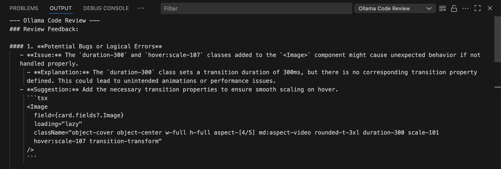

# Ollama Code Review

Get lightning-fast, expert code reviews and AI-generated commit messages directly in your editor using local Ollama models or cloud AI providers like **Claude (Anthropic)**, **Gemini (Google AI)**, **Mistral AI**, **GLM (Z.AI)**, and **Hugging Face**. This extension analyzes your code changes before you commit, helping you catch bugs, improve code quality, and write consistent, informative commit messages.

It leverages the power of local large language models to provide feedback on:
- Potential bugs and logical errors
- Performance optimizations
- Security vulnerabilities
- Adherence to best practices
- Code readability and maintainability

## Usage

You can interact with this extension in two primary ways:

**Command Palette**: Press `Ctrl+Shift+P` (or `Cmd+Shift+P` on Mac), type `Ollama`, and select the desired action from the list.


## Features

**Ollama Code Review** integrates seamlessly into your Git workflow with the following commands:

### 1. Review Staged Changes
- **Command**: `Ollama: Review Staged Changes`
- Get an AI review of all your currently staged changes.
- **Quick Access**: A convenient button `$(comment-discussion)` is also available in the Source Control panel's title bar.


### 2. Generate Commit Message
- **Command**: `Ollama: Generate Commit Message`
- Automatically generates a descriptive, conventional commit message based on your staged changes. The generated message is then populated directly into the Source Control input box.
- **Quick Access**: A `$(sparkle)` icon is available in the Source Control panel's title bar for one-click generation.


### 3. Suggest Code Improvements
- **Command**: `Ollama: Suggestion`
- Select any block of code in your editor, right-click, and choose this command to get an instant refactoring suggestion from Ollama. The extension presents the suggested code and an explanation in a pop-up, allowing you to apply the changes with a single click.


- Alternatively (currently only JavaScript and TypeScript are supported), you can select a block of code, click on the light bulb icon, and choose "Ollama: Suggest Refactoring"


### 4. Inline AI Code Actions (New!)
Select any code in your editor and access powerful AI-powered actions via the lightbulb menu or `Ctrl+.` (`Cmd+.` on Mac):

- **Explain Code**: Get detailed explanations of selected code displayed in a preview panel. Understand complex logic, algorithms, or unfamiliar code patterns.
- **Generate Tests**: Automatically generate unit tests for your code with framework detection (Jest, Mocha, Vitest, etc.). Preview tests before creating the test file.
- **Fix Issue**: Get AI-powered fixes for diagnostics or selected code. View changes in a diff preview before applying them with one click.
- **Add Documentation**: Generate JSDoc/TSDoc comments for functions, classes, and methods. Preview documentation before inserting it into your code.

Each action opens a dedicated preview panel where you can review the AI's output before applying changes to your code.

### 5. Review a Commit Range
- **Command**: `Ollama: Review Commit Range`
- Analyze a series of commits. The extension will prompt you to select a starting commit from your history, and it will generate a review for all changes from that point up to `HEAD`.

### 6. Review Changes Between Two Branches
- **Command**: `Ollama: Review Changes Between Two Branches`
- Ideal for pull requests. Compare any two branches or git refs (like tags or commit hashes) to get a comprehensive review of the differences.

### 7. Detailed Review Output
All feedback from Ollama is displayed in a dedicated "Ollama Code Review" output channel, keeping your editor clean. The output includes a list of the files that were analyzed in the review.



### 8. Agent Skills (Multi-Skill Support)
- **Command**: `Ollama Code Review: Browse Agent Skills`
- **Command**: `Ollama Code Review: Apply Skills to Review`
- **Command**: `Ollama Code Review: Clear Selected Skills`
- Enhance your code reviews by downloading specialized "skills" from GitHub (defaulting to `vercel-labs/agent-skills`).
- These skills provide the AI with specific context or specialized rules (e.g., "Performance Expert," "Security Auditor," or "Accessibility Specialist").
- **Multi-Skill Selection**: Select multiple skills simultaneously to combine their expertise in a single review. For example, apply both "Security Auditor" and "Performance Expert" skills together.
- **Workflow**:
  1. Browse the library and download skills you want to use
  2. Use "Apply Skills to Review" to select one or more skills (previously selected skills are pre-checked)
  3. Run your code review - all selected skills will be applied
  4. Use "Clear Selected Skills" to quickly deselect all skills


### 9. Review a Specific Commit
- **Command**: `Ollama Code Review: Review Commit`
- Review any historical commit. You can enter a hash, select from a list of the 50 most recent commits, or trigger it directly from the **Git Graph** extension context menu.

### 10. Detailed Review Output
All feedback from Ollama is displayed in a dedicated "Ollama Code Review" output channel... 
- **New**: The review panel now features a **"Copy Review"** button to quickly copy the entire Markdown feedback to your clipboard for sharing in Pull Requests or Slack.

### 11. Dynamic Model Selection & Status Bar
- **Command**: `Ollama Code Review: Select Ollama Model`
- **Quick Access**: Look for the model name (e.g., `ollama: llama3`) in the **Status Bar** at the bottom of your editor. Click it to switch models instantly.
- **Auto-Discovery**: The extension automatically fetches all models currently installed on your local Ollama instance.
- **Cloud Support**: Even if Ollama isn't running locally, you can switch to configured cloud-based models (like Kimi, Qwen, or GLM) or set a custom model name.
- **Smart Fallbacks**: If the connection to the Ollama API fails, the extension gracefully provides a list of cloud and custom options so you're never stuck.


### 12. Claude (Anthropic) Support
Use Anthropic's powerful Claude models for code reviews:
- **Claude Sonnet 4** - Fast, capable model for everyday reviews
- **Claude Opus 4** - Most capable model for complex analysis
- **Claude 3.7 Sonnet** - Balanced performance and quality

To use Claude models:
1. Get your API key from [Anthropic Console](https://console.anthropic.com/)
2. Set your API key in settings: `ollama-code-review.claudeApiKey`
3. Select a Claude model from the status bar or command palette

### 13. GLM (Z.AI/Zhipu) Support
Use GLM models via the Z.AI (BigModel/Zhipu) API:
- **GLM-4.7 Flash** - Fast and free-tier model for code reviews

To use GLM models:
1. Get your API key from [Z.AI Open Platform](https://open.bigmodel.cn/)
2. Set your API key in settings: `ollama-code-review.glmApiKey`
3. Select `glm-4.7-flash` from the model picker

### 14. Gemini (Google AI) Support
Use Google's Gemini models via the free Google AI Studio API:
- **Gemini 2.5 Flash** - Fast model with 250 requests/day free tier (15 RPM)
- **Gemini 2.5 Pro** - More capable model with 100 requests/day free tier (5 RPM)
- Both models feature a massive 1-million-token context window

To use Gemini models:
1. Get your API key from [Google AI Studio](https://aistudio.google.com/) (no credit card required)
2. Set your API key in settings: `ollama-code-review.geminiApiKey`
3. Select `gemini-2.5-flash` or `gemini-2.5-pro` from the model picker

### 15. Mistral AI Support
Use Mistral AI's powerful models for code reviews:
- **Mistral Large** - Most capable model for complex analysis
- **Mistral Small** - Fast and efficient for everyday reviews
- **Codestral** - Specifically optimized for code generation and review

To use Mistral models:
1. Get your API key from [Mistral Console](https://console.mistral.ai/)
2. Set your API key in settings: `ollama-code-review.mistralApiKey`
3. Select `mistral-large-latest`, `mistral-small-latest`, or `codestral-latest` from the model picker

### 16. Hugging Face Support
Use any model from the Hugging Face Inference API:
- Access thousands of open-source models
- **Smart Model Picker**: When selecting `huggingface`, a submenu appears with:
  - **Recently Used**: Your last 5 HF models for quick switching
  - **Popular Models**: Curated list of coding models (customizable)
  - **Custom**: Enter any HF model identifier manually
- This makes it easy to quickly switch models when one is busy or returns errors (401/503)

To use Hugging Face models:
1. Get your API token from [Hugging Face Settings](https://huggingface.co/settings/tokens)
2. Set your token in settings: `ollama-code-review.hfApiKey`
3. Select `huggingface` from the model picker → choose from recent, popular, or enter custom
4. (Optional) Customize the popular models list via `ollama-code-review.hfPopularModels`

**Default Popular Models:**
- `Qwen/Qwen2.5-Coder-7B-Instruct`
- `Qwen/Qwen2.5-Coder-32B-Instruct`
- `mistralai/Mistral-7B-Instruct-v0.3`
- `codellama/CodeLlama-7b-Instruct-hf`
- `bigcode/starcoder2-15b`
- `meta-llama/Llama-3.1-8B-Instruct`
- `deepseek-ai/DeepSeek-Coder-V2-Lite-Instruct`

### 17. Smart Diff Filtering
Reduce noise in your code reviews by filtering out irrelevant changes:
- **Ignore paths**: Skip `node_modules`, lock files, build outputs
- **Ignore patterns**: Exclude minified files, source maps, generated code
- **Large file warnings**: Get notified when files exceed a line threshold
- **Formatting-only detection**: Optionally skip files with only whitespace changes

Configure in settings under `ollama-code-review.diffFilter`.

### 18. MCP Server for Claude Desktop
Use the code review functionality directly in Claude Desktop without copy-pasting diffs. The MCP server is available as a separate project:

**Repository:** [gitsage](https://github.com/glorynguyen/gitsage)

Features include:
- **16 Tools Available**: Review staged changes, commits, branches, generate commit messages, explain code, and more
- **Skills Support**: Apply agent skills to enhance reviews
- **Git Integration**: Full access to repository status, commits, and branches

---

## Requirements

You must have the following software installed and configured for this extension to work.

### For Local Ollama Models
1.  **[Ollama](https://ollama.com/)**: Download and install from the official website.
2.  **An Ollama Model**: Pull a model tuned for coding:
    ```bash
    ollama pull kimi-k2.5:cloud
    ```

### For Claude Models (Alternative)
1.  **Anthropic API Key**: Get one from [console.anthropic.com](https://console.anthropic.com/)
2.  **Configure the key** in VS Code settings: `ollama-code-review.claudeApiKey`

### For GLM Models (Alternative)
1.  **Z.AI API Key**: Get one from [open.bigmodel.cn](https://open.bigmodel.cn/)
2.  **Configure the key** in VS Code settings: `ollama-code-review.glmApiKey`

### For Gemini Models (Alternative)
1.  **Google AI Studio API Key**: Get one from [aistudio.google.com](https://aistudio.google.com/) (free, no credit card required)
2.  **Configure the key** in VS Code settings: `ollama-code-review.geminiApiKey`

### For Mistral Models (Alternative)
1.  **Mistral AI API Key**: Get one from [console.mistral.ai](https://console.mistral.ai/)
2.  **Configure the key** in VS Code settings: `ollama-code-review.mistralApiKey`

### For Hugging Face Models (Alternative)
1.  **Hugging Face API Token**: Get one from [huggingface.co/settings/tokens](https://huggingface.co/settings/tokens)
2.  **Configure the token** in VS Code settings: `ollama-code-review.hfApiKey`
3.  **Select a model** from the model picker (recent, popular, or custom) - no need to configure `hfModel` manually!

### General Requirements
1.  **[Git](https://git-scm.com/)**: Git must be installed and available in your system's PATH.
2.  **VS Code Built-in Git Extension**: This extension must be enabled (it is by default).

## Extension Settings

This extension contributes the following settings to your VS Code `settings.json`:

* `ollama-code-review.model`: Supports local Ollama models, cloud models (`kimi-k2.5:cloud`, `qwen3-coder:480b-cloud`, `glm-4.7:cloud`), Claude models (`claude-sonnet-4-20250514`, `claude-opus-4-20250514`, `claude-3-7-sonnet-20250219`), Gemini models (`gemini-2.5-flash`, `gemini-2.5-pro`), Mistral models (`mistral-large-latest`, `mistral-small-latest`, `codestral-latest`), GLM models (`glm-4.7-flash`), Hugging Face (`huggingface`), or `custom`.
* `ollama-code-review.customModel`: Specify your own model name if you select "custom" in the model setting.
* `ollama-code-review.claudeApiKey`: Your Anthropic API key for Claude models.
* `ollama-code-review.glmApiKey`: Your Z.AI (BigModel/Zhipu) API key for GLM models.
* `ollama-code-review.hfApiKey`: Your Hugging Face API token for using Hugging Face models.
* `ollama-code-review.hfModel`: The Hugging Face model to use (default: `Qwen/Qwen2.5-Coder-7B-Instruct`).
* `ollama-code-review.hfPopularModels`: Customize the list of popular Hugging Face models shown in the model picker submenu.
* `ollama-code-review.geminiApiKey`: Your Google AI Studio API key for Gemini models.
* `ollama-code-review.mistralApiKey`: Your Mistral AI API key for Mistral models.
* `ollama-code-review.endpoint`: The API endpoint for your local Ollama instance's generate API.
    * **Type**: `string`
    * **Default**: `"http://localhost:11434/api/generate"`
* `ollama-code-review.skills.defaultRepository`: The GitHub repository to fetch skills from.
    * **Default**: `"vercel-labs/agent-skills"`
* `ollama-code-review.skills.additionalRepositories`: Additional GitHub repositories to fetch skills from (combined with default).
    * **Type**: `array`
    * **Default**: `[]`
* `ollama-code-review.skills.autoApply`: If enabled, selected skills are automatically applied to all subsequent reviews.
    * **Default**: `true`
    * **Note**: Multiple skills can be selected and will be combined in reviews.
* `ollama-code-review.temperature`: The creativity of the AI's response (0.0 for deterministic, 1.0 for very creative).
    * **Type**: `number`
    * **Default**: `0`
* `ollama-code-review.frameworks`: Specify frameworks or libraries (e.g., `React`, `Node.js`) to receive more tailored code reviews aligned with their specific conventions and best practices.
    * **Type**: `array`
    * **Default**: `["React"]`

* `ollama-code-review.diffFilter`: Configure diff filtering to exclude noise from reviews.
    * `ignorePaths`: Glob patterns for paths to ignore (default: `node_modules`, lock files, `dist`, `build`, `out`)
    * `ignorePatterns`: File name patterns to ignore (default: `*.min.js`, `*.min.css`, `*.map`, `*.generated.*`)
    * `maxFileLines`: Warn when a file has more changed lines than this (default: `500`)
    * `ignoreFormattingOnly`: Skip files with only whitespace/formatting changes (default: `false`)

You can configure these by opening the Command Palette (`Ctrl+Shift+P`) and searching for `Preferences: Open User Settings (JSON)`.

**Enjoy!**