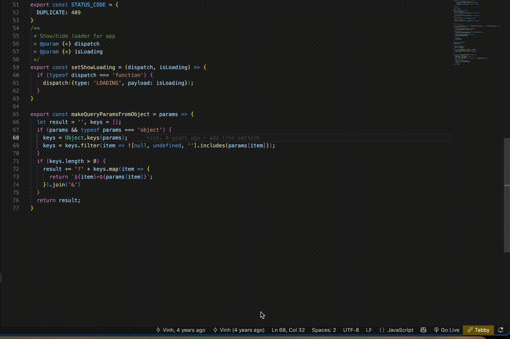

# Ollama Code Review

Get lightning-fast, expert code reviews and AI-generated commit messages directly in your editor using your local Ollama instance. This extension analyzes your code changes before you commit, helping you catch bugs, improve code quality, and write consistent, informative commit messages, all while keeping your code private on your own machine.

It leverages the power of local large language models to provide feedback on:
- Potential bugs and logical errors
- Performance optimizations
- Security vulnerabilities
- Adherence to best practices
- Code readability and maintainability

## Usage

You can interact with this extension in two primary ways:

1.  **Command Palette**: Press `Ctrl+Shift+P` (or `Cmd+Shift+P` on Mac), type `Ollama`, and select the desired action from the list.
2.  **Context Menus**: Use the right-click menu in the editor for selected code or access quick-action buttons in the Source Control panel.


## Features

**Ollama Code Review** integrates seamlessly into your Git workflow with the following commands:

### 1. Review Staged Changes
- **Command**: `Ollama: Review Staged Changes`
- Get an AI review of all your currently staged changes.
- **Quick Access**: A convenient button `$(comment-discussion)` is also available in the Source Control panel's title bar.


### 2. Generate Commit Message
- **Command**: `Ollama: Generate Commit Message`
- Automatically generates a descriptive, conventional commit message based on your staged changes. The generated message is then populated directly into the Source Control input box.
- **Quick Access**: A `$(sparkle)` icon is available in the Source Control panel's title bar for one-click generation.


### 3. Suggest Code Improvements
- **Command**: `Ollama: Suggestion`
- Select any block of code in your editor, right-click, and choose this command to get an instant refactoring suggestion from Ollama. The extension presents the suggested code and an explanation in a pop-up, allowing you to apply the changes with a single click.



### 4. Review a Commit Range
- **Command**: `Ollama: Review Commit Range`
- Analyze a series of commits. The extension will prompt you to select a starting commit from your history, and it will generate a review for all changes from that point up to `HEAD`.

### 5. Review Changes Between Two Branches
- **Command**: `Ollama: Review Changes Between Two Branches`
- Ideal for pull requests. Compare any two branches or git refs (like tags or commit hashes) to get a comprehensive review of the differences.

### 6. Detailed Review Output
All feedback from Ollama is displayed in a dedicated "Ollama Code Review" output channel, keeping your editor clean. The output includes a list of the files that were analyzed in the review.


## Requirements

You must have the following software installed and configured for this extension to work.

1.  **[Ollama](https://ollama.com/)**: The extension requires a running Ollama instance. Please download and install it from the official website.
2.  **An Ollama Model**: You need to have a model pulled to use for the reviews. We recommend a model tuned for coding. You can pull the default model by running:
    ```bash
    ollama pull qwen2.5-coder:14b-instruct-q4_0
    ```
    To verify your setup, you can run the model from your terminal. This command will also pull the model if it doesn't exist and start an interactive session:
    ```bash
    ollama run qwen2.5-coder:14b-instruct-q4_0
    ```
3.  **[Git](https://git-scm.com/)**: Git must be installed and available in your system's PATH.
4.  **VS Code Built-in Git Extension**: This extension must be enabled (it is by default).
5.  **[GitLens Extension](https://marketplace.visualstudio.com/items?itemName=eamodio.gitlens)**: This extension is listed as a dependency to enable some context menu integrations.

## Extension Settings

This extension contributes the following settings to your VS Code `settings.json`:

* `ollama-code-review.model`: The Ollama model to use.
    * **Type**: `string`
    * **Default**: `"qwen2.5-coder:14b-instruct-q4_0"`
* `ollama-code-review.endpoint`: The API endpoint for your local Ollama instance's generate API.
    * **Type**: `string`
    * **Default**: `"http://localhost:11434/api/generate"`
* `ollama-code-review.temperature`: The creativity of the AI's response (0.0 for deterministic, 1.0 for very creative).
    * **Type**: `number`
    * **Default**: `0`
* `ollama-code-review.frameworks`: Specify frameworks or libraries (e.g., `React`, `Node.js`) to receive more tailored code reviews aligned with their specific conventions and best practices.
    * **Type**: `array`
    * **Default**: `["React"]`


You can configure these by opening the Command Palette (`Ctrl+Shift+P`) and searching for `Preferences: Open User Settings (JSON)`.

## Known Issues

* The context menu item "Ollama: Review Commit" that appears when right-clicking a commit in the SCM panel or in GitLens views is currently non-functional. It references a command that has been replaced by the more flexible `reviewCommitRange` command. **Please use the commands from the Command Palette for now.**

## Release Notes

### 1.2.0
*   **New Feature**: Added a new configuration option `ollama-code-review.frameworks` to specify project frameworks or libraries.
*   Providing this context helps the AI generate more tailored code reviews that are aligned with the specific conventions and best practices of the technologies you use.

### 1.1.1
*   **Enhacement**: **Suggest Code Improvements**.
*   Get a better view of code suggestions using a git-diff comparison and a popup with an explanation of the improvements.

### 1.1.0
*   **New Feature**: **Suggest Code Improvements**. Right-click on any selected code in the editor and choose `Ollama: Suggestion` to get instant refactoring ideas.
*   The suggestion is presented in an interactive pop-up, allowing you to review the explanation and apply the new code with a single click.

### 1.0.4
*   **New Feature**: Generate a conventional commit message from staged changes using the `Ollama: Generate Commit Message` command.
*   Added a `$(sparkle)` icon to the Source Control title bar for quick access to commit message generation.
*   Updated SCM title bar to show both review and generate icons.

### 1.0.1

* Added feature: Review all staged changes.
* Added feature: Review a range of commits.
* Added feature: Review the diff between two branches.
* Configurable Ollama model and endpoint.

---

**Enjoy!**