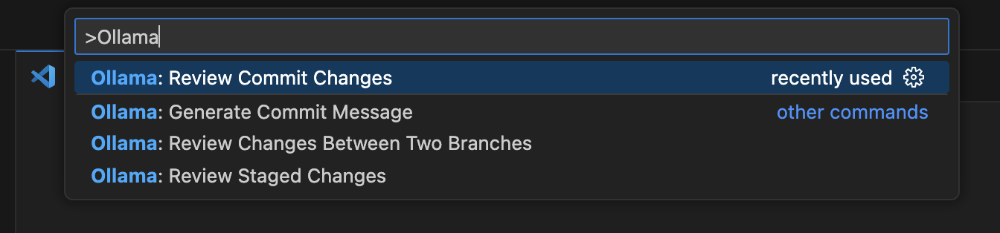

# Ollama Code Review

Get lightning-fast, expert code reviews directly in your editor using your local Ollama instance. This extension analyzes your code changes before you commit, helping you catch bugs, improve quality, and maintain high standards, all while keeping your code private on your own machine.

It leverages the power of local large language models to provide feedback on:
- Potential bugs and logical errors
- Performance optimizations
- Security vulnerabilities
- Adherence to best practices
- Code readability and maintainability

## Usage

The primary way to use this extension is through the VS Code Command Palette.

1.  Press `Ctrl+Shift+P` (or `Cmd+Shift+P` on Mac) to open the Command Palette.
2.  Type `Ollama` to see all available code review commands.
3.  Select the desired review action from the list.



## Features

**Ollama Code Review** integrates seamlessly into your Git workflow with the following commands:

### 1. Review Staged Changes
- **Command**: `Ollama: Review Staged Changes`
- Get an AI review of all your currently staged changes.
- **Quick Access**: A convenient button `$(comment-discussion)` is also available in the Source Control panel's title bar.


### 2. Review Commit Changes
- **Command**: `Ollama: Review Commit Changes`
- Analyze a series of commits. The extension will prompt you to select a starting commit from your history, and it will generate a review for all changes from that point up to `HEAD`.

### 3. Review Changes Between Two Branches
- **Command**: `Ollama: Review Changes Between Two Branches`
- Ideal for pull requests. Compare any two branches or git refs (like tags or commit hashes) to get a comprehensive review of the differences.

### 4. Detailed Review Output
All feedback from Ollama is displayed in a dedicated "Ollama Code Review" output channel, keeping your editor clean. The output includes a list of the files that were analyzed in the review.


## Requirements

You must have the following software installed and configured for this extension to work.

1.  **[Ollama](https://ollama.com/)**: The extension requires a running Ollama instance. Please download and install it from the official website.
2.  **An Ollama Model**: You need to have a model pulled to use for the reviews. We recommend a model tuned for coding. You can pull the default model by running:
    ```bash
    ollama pull qwen2.5-coder:14b-instruct-q4_0
    ```
    To verify your setup, you can run the model from your terminal. This command will also pull the model if it doesn't exist and start an interactive session:
    ```bash
    ollama run qwen2.5-coder:14b-instruct-q4_0
    ```
3.  **[Git](https://git-scm.com/)**: Git must be installed and available in your system's PATH.
4.  **VS Code Built-in Git Extension**: This extension must be enabled (it is by default).
5.  **[GitLens Extension](https://marketplace.visualstudio.com/items?itemName=eamodio.gitlens)**: This extension is listed as a dependency to enable some context menu integrations.

## Extension Settings

This extension contributes the following settings to your VS Code `settings.json`:

* `ollama-code-review.model`: The Ollama model to use for code reviews.
    * **Type**: `string`
    * **Default**: `"qwen2.5-coder:14b-instruct-q4_0"`
* `ollama-code-review.endpoint`: The API endpoint for your local Ollama instance's generate API.
    * **Type**: `string`
    * **Default**: `"http://localhost:11434/api/generate"`

You can configure these by opening the Command Palette (`Ctrl+Shift+P`) and searching for `Preferences: Open User Settings (JSON)`.

## Known Issues

* The context menu item "Ollama: Review Commit" that appears when right-clicking a commit in the SCM panel or in GitLens views is currently non-functional. It references a command that has been replaced by the more flexible `reviewCommitRange` command. **Please use the commands from the Command Palette for now.**

## Release Notes

### 1.0.1

* Added feature: Review all staged changes.
* Added feature: Review a range of commits.
* Added feature: Review the diff between two branches.
* Configurable Ollama model and endpoint.

---

**Enjoy!**